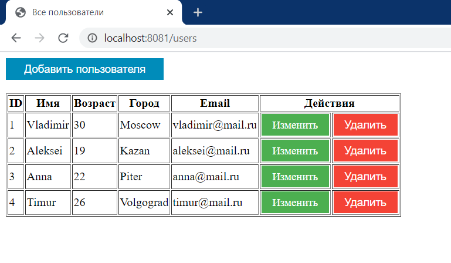
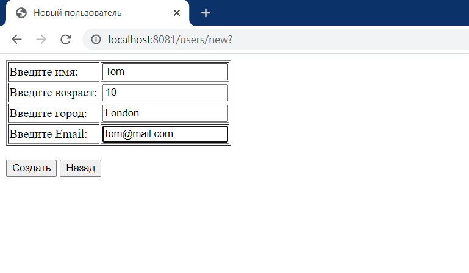
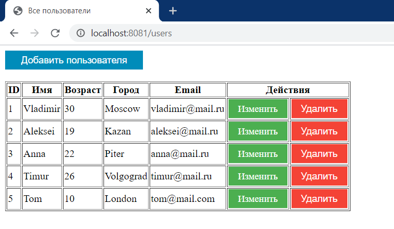
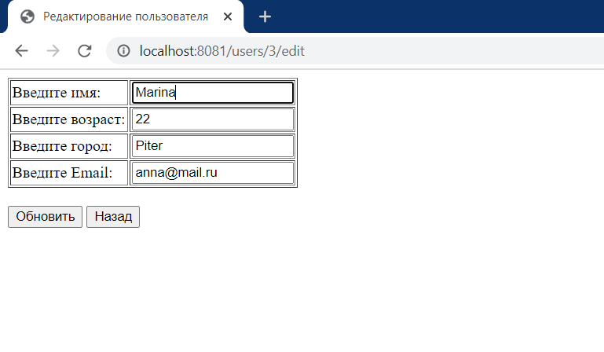
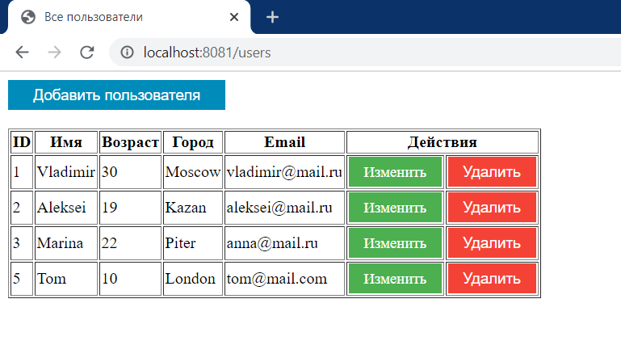
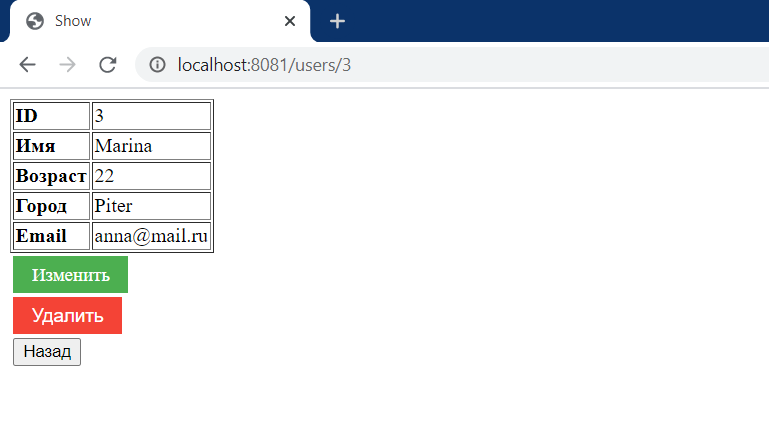

# spring-CRUD

<h2>Список пользователей</h2>
  

<h2>Добавление пользователя</h2>
  

<h2>Пользователь успешно сохранился в БД</h2>
  

<h2>Удаление пользователя</h2>
  

<h2>Редактирование пользователя</h2>
  

<h2>Пользователь успешно отредактирован</h2>
  

<h2>Просмотр пользователя</h2>
  

